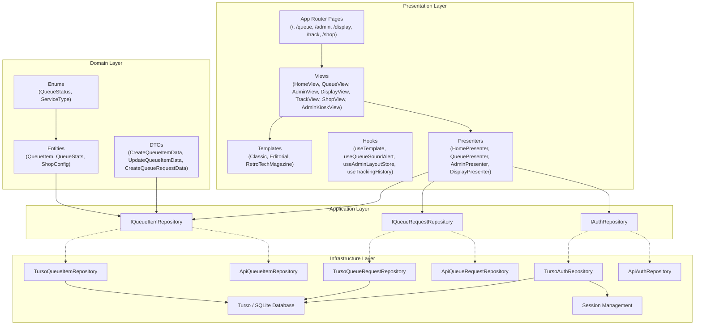
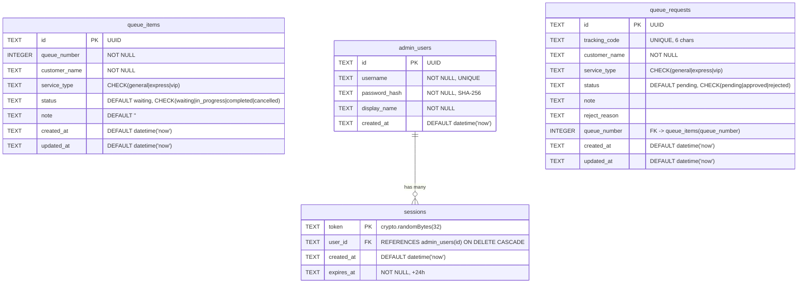
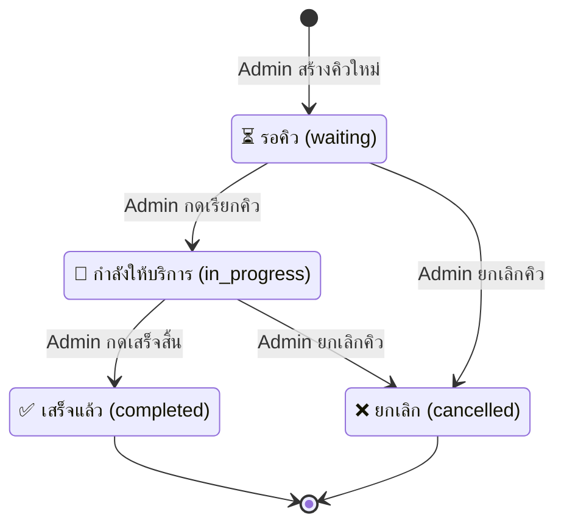
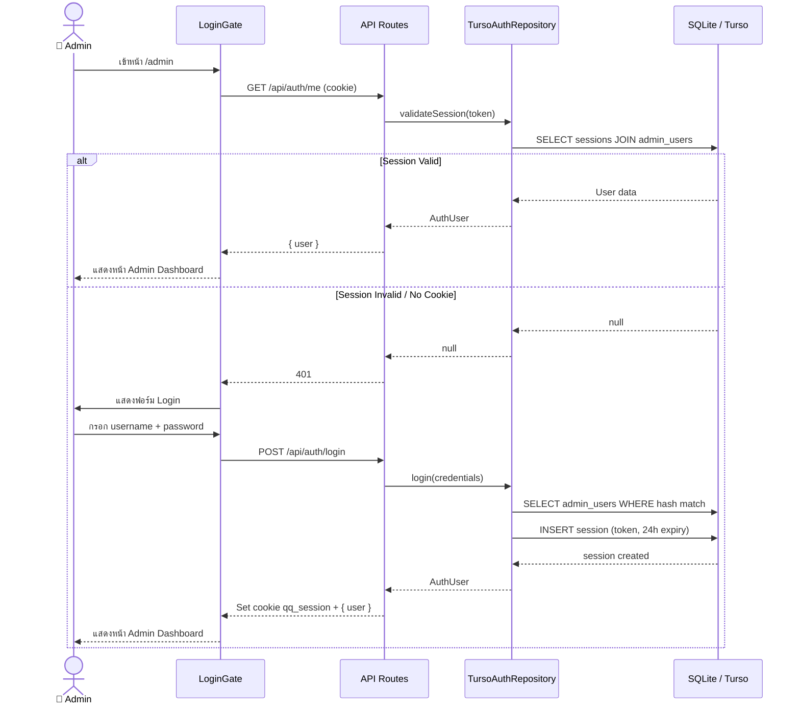
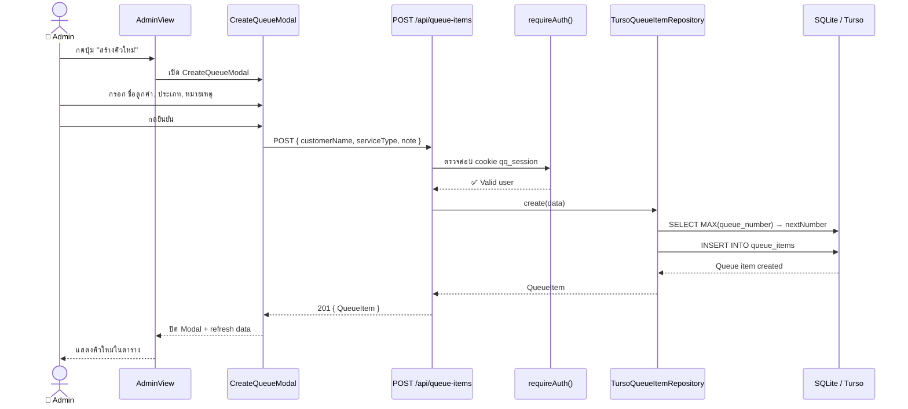
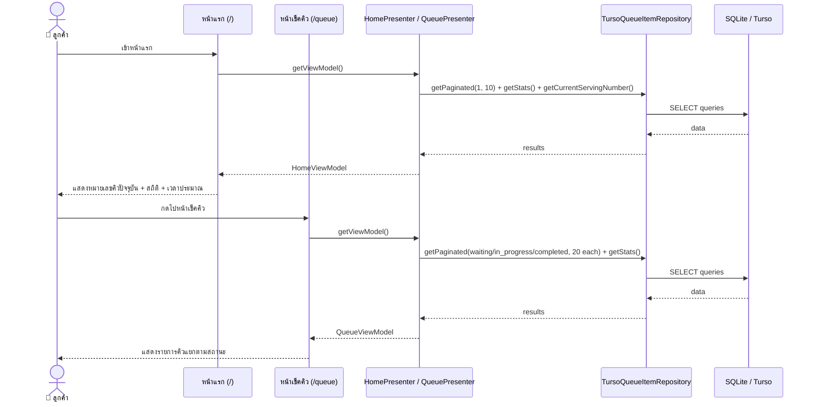
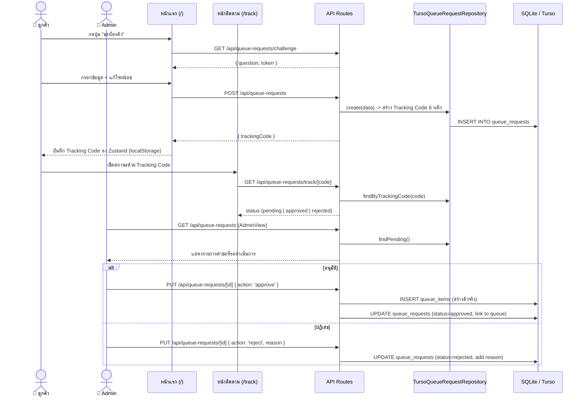
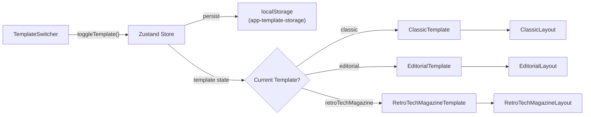
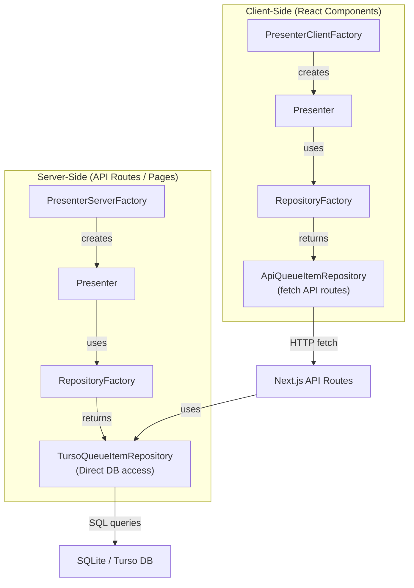

# Quick Queue — AI Context & Workspace Tracking

## 📌 Project Overview

**Quick Queue** (v1.2.2) คือระบบจัดการคิวแบบ Full-Stack สำหรับร้านค้า/ธุรกิจ ที่สร้างด้วย **Next.js 16 (App Router)** ตาม **Clean Architecture** อย่างเคร่งครัด — **UI ทั้งหมดเป็นภาษาไทย**

ระบบมี 3 ส่วนหลัก:
1. **ฝั่งลูกค้า (Public)** — หน้าแรก (Home), หน้าเช็คคิว (Queue), หน้าจอแสดงคิว (Display), หน้าขอบัตรคิว (Display/Request), ติดตามคิว (Track), ข้อมูลร้านค้า (Shop)
2. **ฝั่ง Admin** — Dashboard, จัดการคิว (Queues), คำขอคิวที่รอ (Pending Requests)
3. **ฝั่ง Admin Kiosk** — หน้าจอปฏิบัติการสำหรับพนักงานเคาน์เตอร์ โหมดเต็มจอ เรียก/จัดการคิวแบบ Real-time

---

## 🛠 Tech Stack

| Category | Technology |
|---|---|
| **Core** | Next.js 16 (App Router), React 19, TypeScript |
| **Styling** | Tailwind CSS v4, Glassmorphism, Custom Color Tokens |
| **State** | Zustand (Template, Admin Layout, Tracking History persistence ใน localStorage) |
| **Animations** | React Spring (Physics-based micro-animations) |
| **Database** | SQLite (local, via `@libsql/client`) / Turso (production, cloud edge) |
| **Auth** | Session-based (SHA-256 password hash, HTTP-only cookie `qq_session`) |
| **Others** | `qrcode.react` (QR Code), `uuid` (ID generation), `next-themes` (Dark/Light), `lucide-react` (Icons) |

---

## 🏗 Architecture (Clean Architecture — 4 Layers)



### Layer Details

| Layer | Path | หน้าที่ |
|---|---|---|
| **Domain** | `src/domain/` | Entity types, Enums (QueueStatus, ServiceType), Static configs — ไม่พึ่งพา framework ใดๆ |
| **Application** | `src/application/` | Interface definitions (IQueueItemRepository, IQueueRequestRepository, IAuthRepository) — กำหนด contract |
| **Infrastructure** | `src/infrastructure/` | DB driver (Turso/libSQL), Auth session, Repository implementations (Turso, API, Mock) |
| **Presentation** | `src/presentation/` | React components, Views, Presenters (ViewModel pattern), Hooks, Templates |
| **Config** | `src/config/` | Static configs: `shop.config.ts` (ชื่อร้าน, เวลาเปิดปิด), `queue-display.config.ts` (format เลขคิว), `queue-form.config.ts` (preset ชื่อ/หมายเหตุ) |

---

## ✨ Features ทั้งหมด

### 1. ระบบจัดการคิว (Queue Management)
- **สร้างคิว** — Admin สร้างคิวใหม่โดยกรอกชื่อลูกค้า, ประเภทบริการ, หมายเหตุ
- **อัปเดตสถานะ** — เปลี่ยนสถานะคิว: รอคิว → กำลังให้บริการ → เสร็จแล้ว / ยกเลิก
- **ลบคิว** — ลบรายการคิวทีละรายการ หรือล้างทั้งหมด
- **หมายเลขคิวอัตโนมัติ** — ระบบกำหนดหมายเลขคิวถัดไปให้อัตโนมัติ (MAX + 1)
- **Pagination** — รองรับ pagination สำหรับรายการคิวจำนวนมาก
- **Filter by Status** — กรองรายการตามสถานะ (all, waiting, in_progress, completed, cancelled)

### 2. Admin Kiosk Mode (จอปฏิบัติการ)
- **โหมดเต็มจอ** — แสดงสถานะคิวปัจจุบัน, คิวถัดไป, รายการรอ ในมุมมองเดียว — ออกแบบสำหรับใช้บนเคาน์เตอร์
- **เรียกคิวถัดไป (CALL.NEXT)** — กดปุ่มเดียวเรียกคิวรอถัดไปมาให้บริการ
- **Walk-In** — สร้างคิว Walk-In แบบด่วน
- **เสร็จสิ้น / ข้าม** — กดเสร็จสิ้นหรือข้ามคิวที่กำลังให้บริการ
- **Hero Card** — แสดงคิวที่กำลังให้บริการล่าสุดแบบเด่นชัด พร้อม Service Type Badge
- **Responsive สำหรับ iPad** — ปรับ Layout สำหรับ iPad portrait mode (breakpoint `lg:`)
- **Route**: `/admin/kiosk`

### 3. ระบบแสดงผลสำหรับลูกค้า (Public Display)
- **หน้าแรก (Home `/`)** — แสดงหมายเลขคิวปัจจุบันที่กำลังให้บริการ, สถิติ, เวลาประมาณ, รายการล่าสุด 10 รายการ
- **หน้าเช็คคิว (Queue `/queue`)** — แสดงรายการคิวแยกตามสถานะ: กำลังให้บริการ, รอคิว, เสร็จแล้ว (สูงสุด 20 รายการ/สถานะ)
- **หน้าจอแสดงคิว (Display `/display`)** — หน้าจอเต็มจอสำหรับจอ TV/Monitor แสดงคิวปัจจุบัน, คิวถัดไป, จำนวนรอ, รายการรอ, คิวที่เรียกแล้ว, พร้อมเสียง Alert + ลิงก์ไปขอบัตรคิว/ตรวจสอบคิว
- **หน้าขอบัตรคิว (Display Request `/display/request`)** — ฟอร์ม 3 ขั้นตอน: กรอกข้อมูล → ยืนยันตัวตน (Math Challenge) → ตรวจสอบ/ส่ง พร้อมหน้า Success แสดง Tracking Code + QR Code
- **หน้าติดตามคิว (Track `/track`)** — ตรวจสอบสถานะคำขอคิวผ่านรหัส 6 หลัก พร้อมระบบบันทึกประวัติ (Zustand → localStorage)
- **หน้าข้อมูลร้าน (Shop `/shop`)** — แสดงข้อมูลร้าน, เวลาเปิดปิด, QR Code สำหรับเข้าถึง
- **ระบบขอบัตรคิว (Queue Request)** — ลูกค้ากดขอบัตรคิวได้ พร้อมระบบป้องกันบอท (Math Challenge + IP Rate Limiting)
- **QR Code** — แสดง QR Code สำหรับลูกค้าสแกน
- **Sound Alert** — เสียงแจ้งเตือนเมื่อมีการอัปเดตคิว พร้อม AudioInteractionOverlay
- **Queue Item Detail Modal** — คลิกรายการคิวเพื่อดูรายละเอียด

### 4. ระบบ Template หลายรูปแบบ (Multi-Template System)
- **3 Templates Mood & Tone**:
  1. **Classic Mode**: เน้นความทันสมัย สะอาดตา ใช้งานง่าย (Modern UI / Apple-like) ใช้ความโค้งมน, แสงเงานุ่มนวล, Glassmorphism
  2. **Editorial Mode**: เน้นความเรียบหรู คอนทราสต์จัดจ้าน อารมณ์นิตยสาร (Minimalist / Brutalism) ใช้โทนขาว-ดำ, ขอบเส้นหนา, ฟอนต์ Serif + Sans-serif
  3. **RetroTechMagazine Mode**: สไตล์ Y2K / Cyberpunk ยุค 90s/00s ใช้สีนีออน (Cyan, Magenta, Lime Green), ฟอนต์ Mono, Hard Shadows, UI แนว Terminal/Console
- **ค่าเริ่มต้น**: `retroTechMagazine`
- **สลับได้ทันที** ผ่าน TemplateSwitcher (ใช้ Zustand persist ลง localStorage key `app-template-storage`)
- **ทุก component มีเวอร์ชันของแต่ละ Template** — แยก file เช่น `HomeClassicTemplate.tsx`, `HomeEditorialTemplate.tsx`, `HomeRetroTechMagazineTemplate.tsx`
- **Template ครอบคลุมทุกส่วน**: Home, Queue, Admin, Admin Kiosk, Display, Display Request, Track, Shop, Shared components (QRModal, QueueItemDetailModal, etc.)

### 5. ระบบ Authentication
- **Login** — Admin login ด้วย username/password
- **Session** — ใช้ HTTP-only cookie (`qq_session`) อายุ 24 ชม.
- **LoginGate** — Client-side component ตรวจสอบ session ก่อนแสดงหน้า Admin
- **Dual-Layer Security** — API routes ตรวจ session cookie + Middleware ป้องกันที่ edge

### 6. Dark/Light Mode
- รองรับ Dark/Light color scheme ผ่าน `next-themes`
- Color tokens ในทุก component รองรับทั้ง 2 โหมด

### 7. Animations
- **React Spring** — Physics-based animations สำหรับ modals, buttons, counters
- **AnimatedButton** — ปุ่มที่มี spring animation
- **AnimatedCounter** — ตัวเลขที่เปลี่ยนแบบ animated
- **FadeInSection** — Section ที่ fade in เมื่อ scroll เข้ามา

### 8. Thai Localization (ภาษาไทย)
- **UI ทั้งหมดเป็นภาษาไทย** — ปุ่ม, ป้ายกำกับ, ข้อความสถานะ, ข้อผิดพลาด, ข้อความว่าง ทั้งหมดเป็นภาษาไทย
- **เก็บ Jargon เฉพาะ** — คำเฉพาะบางคำเก็บไว้เป็นภาษาอังกฤษตามสไตล์ของ Template (เช่น `CALL.NEXT()`, `WALK_IN.ADD()`, `GENERAL`, `EXPRESS`, `VIP`, `CONFIRM_`)

### 9. Database CLI Scripts
| Command | หน้าที่ |
|---|---|
| `yarn db:migrate` | สร้าง schema (tables + indexes) |
| `yarn db:seed:starter` | สร้าง admin user เริ่มต้น (admin/admin) |
| `yarn db:seed:mock` | สร้างข้อมูล mock 1,000 รายการ |
| `yarn db:reset` | ล้าง DB + seed starter |
| `yarn db:reset:mock` | ล้าง DB + seed mock data |
| `yarn db:password` | เปลี่ยนรหัสผ่าน admin |

---

## 🗄 Database Schema

ใช้ **SQLite** (local) หรือ **Turso** (production) ผ่าน `@libsql/client`



### Indexes
- `idx_queue_items_status` — เร่ง query ตาม status
- `idx_queue_items_queue_number` — เร่ง query ตาม queue_number
- `idx_sessions_user_id` — เร่ง join sessions → admin_users
- `idx_sessions_expires_at` — เร่ง expire check

---

## 🔌 API Routes

### Auth Routes

| Method | Route | Auth | หน้าที่ |
|---|---|---|---|
| POST | `/api/auth/login` | ❌ | Login → สร้าง session → set HTTP-only cookie |
| POST | `/api/auth/logout` | ❌ | Logout → ลบ session จาก DB + clear cookie |
| GET | `/api/auth/me` | ✅ | ตรวจสอบ session ปัจจุบัน → return user info |

### Queue Items Routes

| Method | Route | Auth | หน้าที่ |
|---|---|---|---|
| GET | `/api/queue-items` | ❌ | ดึงรายการคิว (all หรือ paginated + filter by status) |
| POST | `/api/queue-items` | ✅ | สร้างคิวใหม่ |
| DELETE | `/api/queue-items` | ✅ | ล้างคิวทั้งหมด |
| GET | `/api/queue-items/[id]` | ❌ | ดึงคิวตาม ID |
| PUT | `/api/queue-items/[id]` | ✅ | อัปเดตคิว (status, name, type, note) |
| DELETE | `/api/queue-items/[id]` | ✅ | ลบคิวตาม ID |
| GET | `/api/queue-items/stats` | ❌ | สถิติคิว (total, waiting, in_progress, completed, cancelled) |
| GET | `/api/queue-items/next-number` | ❌ | หมายเลขคิวถัดไป |
| GET | `/api/queue-items/current-serving` | ❌ | หมายเลขคิวที่กำลังให้บริการ |
| GET | `/api/queue-items/by-status` | ❌ | ดึงคิวแยกตามสถานะ (serving, waiting, completed) |
| GET | `/api/queue-items/performance` | ❌ | ข้อมูล Performance (เวลารอเฉลี่ย ฯลฯ) |
| GET | `/api/queue-items/recent-activity` | ❌ | รายการ Activity ล่าสุด |

### Queue Requests Routes (ระบบขอบัตรคิวออนไลน์)

| Method | Route | Auth | หน้าที่ |
|---|---|---|---|
| POST | `/api/queue-requests` | ❌ | ลูกค้าขอบัตรคิว (Math Challenge + IP Rate Limit) |
| GET | `/api/queue-requests` | ✅ | Admin ดึงรายการคำขอที่รอ (pending) |
| PUT | `/api/queue-requests/[id]` | ✅ | Admin อนุมัติ/ปฏิเสธ คำขอ |
| GET | `/api/queue-requests/track/[code]` | ❌ | เช็คสถานะคำขอผ่าน Tracking Code |
| GET | `/api/queue-requests/challenge` | ❌ | รับโจทย์คณิตศาสตร์ (ป้องกัน Bot) |

---

## 🔄 Workflow Diagrams

### Flow 1: Queue Lifecycle (สถานะคิว)



### Flow 2: Admin Login & Queue Management



### Flow 3: สร้างคิวใหม่ (Create Queue Item)



### Flow 4: ลูกค้าเช็คคิว (Customer View)



### Flow 5: ระบบขอบัตรคิวออนไลน์ (Online Queue Request)



### Flow 6: Template Switching



### Flow 7: Repository Pattern (Dependency Injection)



---

## 📂 Directory Structure

```
quick-queue-nextjs/
├── app/                                    # Next.js App Router
│   ├── layout.tsx                          # Root layout + ThemeProvider
│   ├── page.tsx                            # Home page (Server Component)
│   ├── loading.tsx                         # Global loading skeleton
│   ├── admin/
│   │   ├── layout.tsx                      # Admin layout (LoginGate wrapper)
│   │   ├── page.tsx                        # Admin Dashboard
│   │   ├── kiosk/page.tsx                  # Admin Kiosk (full-screen counter)
│   │   ├── queues/page.tsx                 # Admin Queue Management
│   │   └── pending-requests/page.tsx       # Admin Pending Requests
│   ├── display/
│   │   ├── page.tsx                        # Public Display (TV/Monitor)
│   │   └── request/page.tsx               # Customer Queue Request form
│   ├── queue/page.tsx                      # Queue status page
│   ├── track/page.tsx                      # Track queue by code
│   ├── shop/page.tsx                       # Shop info page
│   └── api/
│       ├── auth/{login,logout,me}/         # Auth endpoints
│       ├── queue-items/                    # CRUD + stats + by-status + performance + recent-activity
│       └── queue-requests/                 # Request CRUD + challenge + track
├── src/
│   ├── config/
│   │   ├── shop.config.ts                 # ShopConfig (ชื่อร้าน, เวลาเปิดปิด)
│   │   ├── queue-display.config.ts        # Queue number formatting
│   │   └── queue-form.config.ts           # Preset names/notes for forms
│   ├── domain/
│   │   └── types/queue.ts                 # QueueItem, QueueStatus, ServiceType, DTOs
│   ├── application/
│   │   └── repositories/
│   │       ├── IQueueItemRepository.ts
│   │       ├── IQueueRequestRepository.ts
│   │       └── IAuthRepository.ts
│   ├── infrastructure/
│   │   ├── auth/session.ts                # requireAuth() helper
│   │   ├── database/                      # turso.ts, migrate, seed, reset, change-password
│   │   └── repositories/
│   │       ├── RepositoryFactory.ts
│   │       ├── turso/                     # TursoQueueItem, TursoQueueRequest, TursoAuth
│   │       ├── api/                       # ApiQueueItem, ApiQueueRequest, ApiAuth
│   │       └── mock/                      # MockQueueItem, MockAuth
│   └── presentation/
│       ├── hooks/
│       │   ├── useTemplate.ts             # Zustand: template switching (default: retroTechMagazine)
│       │   ├── useQueueSoundAlert.ts      # Sound notifications
│       │   ├── useAppVersion.ts           # Build version display
│       │   ├── useAdminLayoutStore.ts     # Admin sidebar/layout state
│       │   └── useTrackingHistory.ts      # Zustand: tracking code history (localStorage)
│       ├── presenters/
│       │   ├── home/                      # HomePresenter + Server/Client factories
│       │   ├── queue/                     # QueuePresenter + Server/Client factories
│       │   ├── admin/                     # AdminPresenter + Server/Client factories
│       │   └── display/                   # DisplayPresenter + Server/Client factories
│       ├── providers/                     # Context providers
│       └── components/
│           ├── shared/                    # AnimatedButton, GlassCard, QRModal, StatusBadge,
│           │   │                          # QueueItemDetailModal, AudioInteractionOverlay,
│           │   │                          # CustomSelect, ColorModeToggle, FadeInSection
│           │   └── templates/             # Shared template variants (modals, badges, etc.)
│           ├── layout/                    # MainTemplate, Header, Footer, TemplateSwitcher
│           ├── home/                      # HomeView + 3 template variants
│           ├── queue/                     # QueueView + 3 template variants
│           ├── admin/
│           │   ├── AdminView.tsx          # Dashboard view
│           │   ├── AdminLayoutView.tsx    # Admin layout with sidebar nav
│           │   ├── LoginGate.tsx          # Auth gate component
│           │   ├── kiosk/                 # AdminKioskView + 3 template variants
│           │   ├── queues/                # Queue management views
│           │   ├── templates/             # Admin dashboard templates
│           │   └── widgets/               # Dashboard widgets (stats, charts)
│           ├── display/
│           │   ├── DisplayView.tsx        # Public display view + track modal
│           │   ├── templates/             # 3 Display templates (Classic, Editorial, RetroTech)
│           │   └── request/
│           │       ├── DisplayRequestView.tsx  # Request flow (3-step form)
│           │       └── templates/         # 3 Request templates
│           ├── track/                     # TrackView + 3 template variants
│           └── shop/                      # ShopView + ShopInfoBanner + 3 template variants
└── data/                                  # Local SQLite database files
```

---

## 📝 Context for AI (Continuity)

1. **Clean Architecture** — ห้ามข้ามชั้น layer โดยตรง (เช่น Presentation ห้ามเรียก DB) ต้องผ่าน Repository interface เสมอ
2. **Multi-Template** — ทุก component ที่ render UI ต้องมี 3 เวอร์ชัน (Classic, Editorial, RetroTechMagazine) แยก file ชัดเจน
3. **Server vs Client** — Pages เป็น Server Components, Views เป็น Client Components ที่รับ `initialViewModel` จาก server
4. **Repository Factory** — Server-side ใช้ `TursoRepository` (direct DB), Client-side ใช้ `ApiRepository` (fetch API routes)
5. **Auth** — ใช้ HTTP-only cookie `qq_session`, ตรวจผ่าน `requireAuth()` ใน API routes ที่ต้อง auth
6. **DB** — Dev ใช้ local SQLite file (`data/quick-queue.db`), Production ใช้ Turso cloud (ตั้งค่า env `DB_PROVIDER=turso`)
7. **Thai Localization** — UI text ทั้งหมดเป็นภาษาไทย เก็บ Jargon เฉพาะ (เช่น `CALL.NEXT()`, `GENERAL`, `VIP`) ตามสไตล์ Template
8. **Admin Layout** — Admin ใช้ Layout component (`AdminLayoutView`) พร้อม sidebar navigation: Dashboard → Queues → Pending Requests → Kiosk
9. **Responsive Kiosk** — Kiosk templates ใช้ `lg:` breakpoint เพื่อให้ iPad portrait ได้ mobile layout
10. **Config Files** — `src/config/` เก็บ static config ที่ใช้ทั่ว app: ชื่อร้าน (`shop.config.ts`), format เลขคิว (`queue-display.config.ts`), preset ฟอร์ม (`queue-form.config.ts`)
