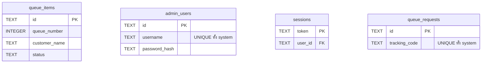
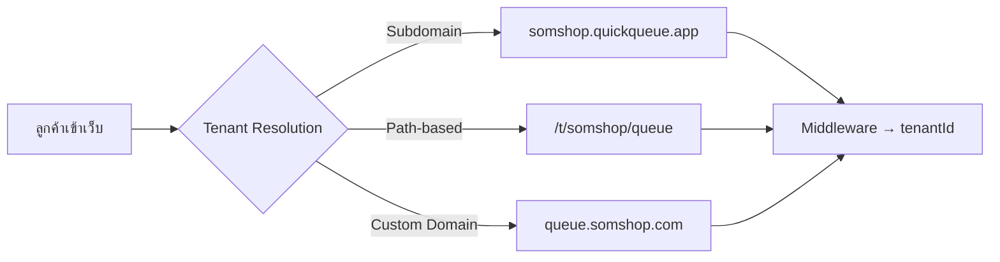
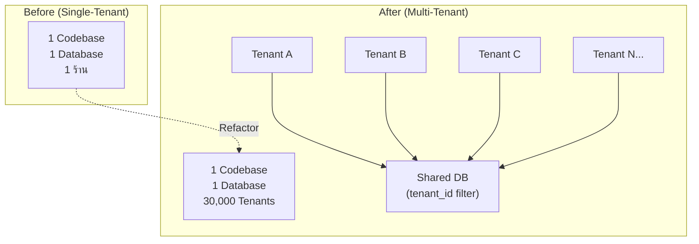

# 🏢 Multi-Tenancy Refactoring Analysis — Quick Queue

## สรุปปัญหา (Problem Statement)

ปัจจุบัน Quick Queue ออกแบบเป็น **Single-Tenant** — 1 instance = 1 ร้านค้า

หากต้องการขาย SaaS ให้ลูกค้า 30,000 ราย:

| แนวทาง | ข้อเสีย |
|---|---|
| ❌ Fork repo ต่อลูกค้า | ต้อง maintain 30,000 repos — อัปเดตฟีเจอร์ทีละ 30,000 ที่ |
| ❌ Deploy instance ต่อลูกค้า | ต้องจัดการ 30,000 servers — ค่า infra สูงมาก |
| ✅ **Multi-Tenant Shared Codebase** | **1 codebase, 1 deployment, 30,000 tenants** |

---

## สถานะปัจจุบัน — จุดที่ต้อง Refactor

### 1. 🗄 Database Schema — ไม่มี `tenant_id`



> [!CAUTION]
> ทุกตารางไม่มี `tenant_id` — ข้อมูลทุกรายเป็นของ "ร้านเดียว" ปะปนกันหมด

---

### 2. ⚙️ Config Files — Hardcoded เป็น Static

| ไฟล์ | ปัญหา |
|---|---|
| [shop.config.ts](file:///Users/marosdeeuma/quick-queue-nextjs/src/config/shop.config.ts) | ชื่อร้าน, เวลาเปิดปิด → hardcoded เป็น 1 ร้าน |
| [queue-display.config.ts](file:///Users/marosdeeuma/quick-queue-nextjs/src/config/queue-display.config.ts) | Prefix เลขคิว (A001) → ใช้ค่าเดียว |
| [queue-form.config.ts](file:///Users/marosdeeuma/quick-queue-nextjs/src/config/queue-form.config.ts) | Preset ชื่อ/หมายเหตุ → ใช้ชุดเดียว |

---

### 3. 🔐 Auth — ไม่ผูก Tenant

- `admin_users.username` เป็น `UNIQUE` ทั้ง DB → ถ้ามี 2 ร้านใช้ username "admin" ก็จะชน
- `sessions` ไม่รู้ว่า user คนนี้เป็น admin ของร้านไหน
- [requireAuth()](file:///Users/marosdeeuma/quick-queue-nextjs/src/infrastructure/auth/session.ts#5-38) คืน [AuthUser](file:///Users/marosdeeuma/quick-queue-nextjs/src/application/repositories/IAuthRepository.ts#7-12) แต่ไม่มี `tenantId`

---

### 4. 🛣 Routing — ไม่มี Tenant Identifier

- URL ปัจจุบัน: `/`, `/queue`, `/admin`, `/display`
- ไม่มี path parameter หรือ subdomain ที่ระบุ tenant
- ลูกค้าเข้าเว็บมาไม่รู้ว่ากำลังดูร้านไหน

---

### 5. 📦 Repository Layer — Query ไม่ filter by tenant

- [TursoQueueItemRepository](file:///Users/marosdeeuma/quick-queue-nextjs/src/infrastructure/repositories/turso/TursoQueueItemRepository.ts#40-257) query ตรงๆ: `SELECT * FROM queue_items`
- ไม่มี `WHERE tenant_id = ?` ในทุก query
- `RepositoryFactory` สร้าง repository แบบ global ไม่ pass context ใดๆ

---

### 6. 🌐 API Routes — ไม่ Extract Tenant จาก Request

- 15 API routes ทั้งหมดไม่มี tenant context
- Repository ถูก instantiate ที่ module scope: `const repository = getQueueItemRepository();`

---

## แผนการ Refactor ให้เป็น Multi-Tenant

### Phase 1: Tenant Identity & Routing



#### สิ่งที่ต้องทำ

| # | งาน | ไฟล์ที่เกี่ยว |
|---|---|---|
| 1.1 | **สร้าง Tenant Resolution Strategy** — เลือกระหว่าง Subdomain / Path / Custom Domain | ใหม่: `middleware.ts` |
| 1.2 | **สร้าง Middleware** — extract tenantId จาก request แล้วแปะลง header/cookie | ใหม่: `middleware.ts` |
| 1.3 | **สร้าง Tenant Context** — React Context / Server-side helper ให้ทุก layer เข้าถึง tenantId ได้ | ใหม่: `src/infrastructure/tenant/` |

> [!IMPORTANT]
> **แนะนำ: ใช้ Subdomain-based** (`{slug}.quickqueue.app`) เพราะ:
> - URL สั้น สะอาด
> - ไม่ต้อง rewrite ทุก route
> - รองรับ Custom Domain ในอนาคตได้ง่าย

---

### Phase 2: Database Schema Migration

#### 2.1 สร้างตาราง `tenants`

```sql
CREATE TABLE tenants (
  id          TEXT PRIMARY KEY,         -- UUID
  slug        TEXT NOT NULL UNIQUE,     -- subdomain identifier
  name        TEXT NOT NULL,            -- ชื่อร้าน
  description TEXT DEFAULT '',
  max_queue_per_day INTEGER DEFAULT 100,
  operating_hours_open  TEXT DEFAULT '09:00',
  operating_hours_close TEXT DEFAULT '18:00',
  queue_prefix     TEXT DEFAULT 'A',
  queue_pad_length INTEGER DEFAULT 3,
  plan        TEXT DEFAULT 'free',      -- free / pro / enterprise
  is_active   BOOLEAN DEFAULT TRUE,
  created_at  TEXT NOT NULL DEFAULT (datetime('now')),
  updated_at  TEXT NOT NULL DEFAULT (datetime('now'))
);
```

#### 2.2 เพิ่ม `tenant_id` ในทุกตาราง

```diff
 CREATE TABLE queue_items (
   id            TEXT PRIMARY KEY,
+  tenant_id     TEXT NOT NULL REFERENCES tenants(id),
   queue_number  INTEGER NOT NULL,
   ...
 );

 CREATE TABLE admin_users (
   id            TEXT PRIMARY KEY,
+  tenant_id     TEXT NOT NULL REFERENCES tenants(id),
   username      TEXT NOT NULL,
-  -- UNIQUE(username) ทั้ง DB
+  -- UNIQUE(tenant_id, username) → username ซ้ำได้ถ้าคนละ tenant
   ...
 );

 CREATE TABLE sessions (
   token      TEXT PRIMARY KEY,
   user_id    TEXT NOT NULL,
+  tenant_id  TEXT NOT NULL REFERENCES tenants(id),
   ...
 );

 CREATE TABLE queue_requests (
   id             TEXT PRIMARY KEY,
+  tenant_id      TEXT NOT NULL REFERENCES tenants(id),
   tracking_code  TEXT NOT NULL,
-  -- UNIQUE(tracking_code) ทั้ง DB
+  -- UNIQUE(tenant_id, tracking_code)
   ...
 );
```

#### 2.3 Indexes ใหม่ (Composite Indexes)

```sql
CREATE INDEX idx_queue_items_tenant_status ON queue_items(tenant_id, status);
CREATE INDEX idx_queue_items_tenant_number ON queue_items(tenant_id, queue_number);
CREATE INDEX idx_admin_users_tenant ON admin_users(tenant_id, username);
CREATE INDEX idx_sessions_tenant ON sessions(tenant_id);
CREATE INDEX idx_queue_requests_tenant_status ON queue_requests(tenant_id, status);
CREATE UNIQUE INDEX idx_queue_requests_tenant_tracking ON queue_requests(tenant_id, tracking_code);
```

---

### Phase 3: Domain & Application Layer

#### 3.1 สร้าง Tenant Entity

```typescript
// src/domain/types/tenant.ts
export interface Tenant {
  id: string;
  slug: string;
  name: string;
  description: string;
  maxQueuePerDay: number;
  operatingHours: { open: string; close: string };
  queuePrefix: string;
  queuePadLength: number;
  plan: 'free' | 'pro' | 'enterprise';
  isActive: boolean;
}
```

#### 3.2 อัปเดต Repository Interfaces

```diff
 // IQueueItemRepository.ts
 export interface IQueueItemRepository {
-  getAll(): Promise<QueueItem[]>;
+  getAll(tenantId: string): Promise<QueueItem[]>;
-  create(data: CreateQueueItemData): Promise<QueueItem>;
+  create(tenantId: string, data: CreateQueueItemData): Promise<QueueItem>;
   // ... ทุก method ต้องรับ tenantId
 }
```

> [!TIP]
> **ทางเลือกที่ดีกว่า**: แทนที่จะ pass `tenantId` ในทุก method ใช้ **Scoped Repository** — สร้าง repository ที่ถูก bind กับ tenant ตั้งแต่ต้น:
> ```typescript
> // RepositoryFactory สร้าง repository ที่ scoped by tenant
> const repo = getQueueItemRepository(tenantId);
> repo.getAll(); // ← auto-filter by tenant_id
> ```

#### 3.3 Config Files → ย้ายเข้า DB

| Config เดิม | ย้ายไปที่ |
|---|---|
| [shop.config.ts](file:///Users/marosdeeuma/quick-queue-nextjs/src/config/shop.config.ts) (ชื่อร้าน, เวลา) | `tenants` table |
| [queue-display.config.ts](file:///Users/marosdeeuma/quick-queue-nextjs/src/config/queue-display.config.ts) (prefix, pad) | `tenants.queue_prefix`, `tenants.queue_pad_length` |
| [queue-form.config.ts](file:///Users/marosdeeuma/quick-queue-nextjs/src/config/queue-form.config.ts) (presets) | ตารางใหม่ `tenant_form_presets` หรือ JSON column ใน `tenants` |

---

### Phase 4: Infrastructure Layer

#### 4.1 Turso Repository — เพิ่ม tenant filter

```diff
 // TursoQueueItemRepository.ts
 class TursoQueueItemRepository {
+  constructor(private tenantId: string) {}

   async getAll() {
-    const result = await this.db().execute('SELECT * FROM queue_items');
+    const result = await this.db().execute({
+      sql: 'SELECT * FROM queue_items WHERE tenant_id = ?',
+      args: [this.tenantId],
+    });
   }
 }
```

#### 4.2 RepositoryFactory — รับ tenantId

```diff
-export function getQueueItemRepository(): IQueueItemRepository {
-  return new TursoQueueItemRepository();
+export function getQueueItemRepository(tenantId: string): IQueueItemRepository {
+  return new TursoQueueItemRepository(tenantId);
 }
```

#### 4.3 Auth — ผูก Tenant

```diff
 // session.ts - requireAuth()
 export async function requireAuth(request: NextRequest): Promise<{
   user?: AuthUser;
+  tenantId?: string;
   errorResponse?: NextResponse;
 }> {
   // ... validate session
+  // ดึง tenantId จาก session หรือ middleware header
+  const tenantId = request.headers.get('x-tenant-id');
-  return { user };
+  return { user, tenantId };
 }
```

---

### Phase 5: API Routes — Inject Tenant

```diff
 // app/api/queue-items/route.ts
-const repository = getQueueItemRepository();
 
 export async function GET(request: NextRequest) {
+  const tenantId = request.headers.get('x-tenant-id');
+  if (!tenantId) return NextResponse.json({ error: 'Tenant not found' }, { status: 404 });
+
+  const repository = getQueueItemRepository(tenantId);
   const items = await repository.getAll();
   // ...
 }
```

> [!WARNING]
> **ต้องเปลี่ยนทั้ง 15 API routes** — repository ต้องสร้างใน function ไม่ใช่ module scope

---

### Phase 6: Presentation Layer

#### 6.1 Config → Dynamic

```diff
 // app/page.tsx
-import { DEFAULT_SHOP_CONFIG } from '@/src/config/shop.config';
+// ดึง tenant config จาก DB แทน
+const tenant = await getTenantBySlug(slug);
```

#### 6.2 Tenant Provider

```typescript
// src/presentation/providers/TenantProvider.tsx
export const TenantContext = createContext<Tenant | null>(null);

export function TenantProvider({ tenant, children }) {
  return (
    <TenantContext.Provider value={tenant}>
      {children}
    </TenantContext.Provider>
  );
}
```

#### 6.3 Layout — Wrap with TenantProvider

```diff
 // app/layout.tsx
+import { TenantProvider } from '@/src/presentation/providers/TenantProvider';

 export default async function RootLayout({ children }) {
+  const tenant = await resolveTenant(/* from headers/cookies */);
   return (
     <html>
       <body>
+        <TenantProvider tenant={tenant}>
           {children}
+        </TenantProvider>
       </body>
     </html>
   );
 }
```

---

### Phase 7: Tenant Onboarding & Management

#### 7.1 ตารางเพิ่มเติม

```sql
-- Subscription / Billing
CREATE TABLE tenant_subscriptions (
  id          TEXT PRIMARY KEY,
  tenant_id   TEXT NOT NULL REFERENCES tenants(id),
  plan        TEXT NOT NULL DEFAULT 'free',
  started_at  TEXT NOT NULL,
  expires_at  TEXT,
  is_active   BOOLEAN DEFAULT TRUE
);
```

#### 7.2 Routes ใหม่

| Route | หน้าที่ |
|---|---|
| `/register` | ลูกค้าสมัครใช้งาน → สร้าง tenant + admin user |
| `/super-admin` | ระบบจัดการ tenants ทั้งหมด (สำหรับเจ้าของ platform) |

---

## สรุปภาพรวม Refactoring



---

## ปริมาณงาน Effort Estimation

| Phase | งาน | Effort | Risk |
|---|---|---|---|
| **Phase 1** | Tenant Resolution & Middleware | 🟡 Medium | 🟡 Medium |
| **Phase 2** | DB Schema Migration | 🔴 High | 🔴 High — data migration |
| **Phase 3** | Domain & Application Layer | 🟡 Medium | 🟢 Low |
| **Phase 4** | Infrastructure (Repositories) | 🔴 High | 🟡 Medium |
| **Phase 5** | API Routes (15 routes) | 🟡 Medium | 🟢 Low |
| **Phase 6** | Presentation Layer | 🟡 Medium | 🟢 Low |
| **Phase 7** | Onboarding & Super Admin | 🔴 High | 🟡 Medium |

> [!NOTE]
> **ทั้งหมดประมาณ 3–5 สัปดาห์** สำหรับ developer 1 คน (ขึ้นอยู่กับ scope ของ Phase 7)

---

## Database Strategy — 1 DB หรือ DB per Tenant?

| Strategy | Pros | Cons | เหมาะกับ |
|---|---|---|---|
| **Shared DB + `tenant_id`** | ง่าย deploy, ถูก, query ข้าม tenant ง่าย | Data leak risk ถ้า WHERE หลุด | < 10,000 tenants |
| **Schema per Tenant** | แยก data ชัด | ซับซ้อน, migration ยาก | 100–10,000 tenants |
| **DB per Tenant** (Turso branch) | Isolation สูงสุด, Turso รองรับ | แพง, deploy ซับซ้อน | Enterprise / compliance |

> [!TIP]
> **แนะนำ: Shared DB + `tenant_id`** สำหรับ 30,000 ราย — Turso cloud เหมาะกับ approach นี้ และ Clean Architecture ที่มีอยู่ช่วยให้ refactor ได้ค่อนข้างตรงไปตรงมา เพราะ Repository Pattern ทำหน้าที่เป็น boundary อยู่แล้ว

---

## ข้อดีของ Architecture ปัจจุบันที่ช่วยได้

| จุดแข็ง | ทำไมช่วย |
|---|---|
| **Repository Pattern** | แก้ SQL query ที่จุดเดียว — ใส่ `WHERE tenant_id = ?` ใน Turso repos |
| **RepositoryFactory** | เปลี่ยนเป็นรับ `tenantId` param ได้ง่าย |
| **Presenter Pattern** | Presenter สร้างใหม่ต่อ request → inject tenant context ง่าย |
| **API Routes** แยกจาก Presentation | เพิ่ม tenant middleware ได้โดยไม่กระทบ UI |
| **Clean Architecture 4 Layers** | แต่ละ layer เปลี่ยนแยกจากกัน ไม่ ripple effect มาก |
