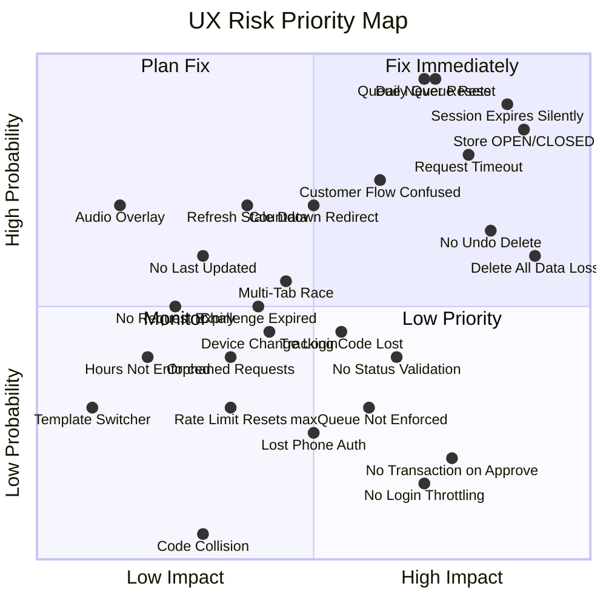

# Quick Queue — UX Risk & Confusion Analysis

> Deep analysis of `quick-queue-nextjs` v1.2.2 codebase. Scenarios #1–17 verified against actual code. Scenarios #18–27 are **identified gaps** — features/safeguards that should exist but currently don't.

---

## Summary of Findings

| Risk Level | Count |
|---|---|
| 🔴 **High** | 9 |
| 🟡 **Medium** | 11 |
| 🟢 **Low** | 7 |

---

## 🔴 HIGH RISK Scenarios

---

### 1. "Delete All Queues" — Irreversible Mass Data Loss

**Risk Level:** 🔴 High

**Trigger Condition:**
Admin clicks "ล้างคิวทั้งหมด" (Clear All Queues). The API `DELETE /api/queue-items` calls `repository.deleteAll()` which runs `DELETE FROM queue_items` — wiping every queue item in the database including active/in-progress items.

**What the user is likely thinking:**
_"I want to clear finished queues from yesterday. This probably just clears old ones, right?"_

**Preventive UX Intervention:**
The existing `isClearAllModalOpen` modal must show a **destructive confirmation** with explicit count of active items that will be destroyed.

**Exact microcopy:**
> ⚠️ จะลบคิวทั้งหมด **{total} รายการ** รวมถึง {inProgress} รายการที่กำลังให้บริการอยู่
> การกระทำนี้ไม่สามารถเรียกคืนได้ — พิมพ์ "ล้างคิว" เพื่อยืนยัน

**Suggested UI format:** Modal with text-input confirmation (type to confirm pattern)

**When hint should disappear:** After action completes or modal closes

**Should escalate if ignored:** N/A (blocking modal)

---

### 2. Session Expires Mid-Operation — Silent 401 Failures

**Risk Level:** 🔴 High

**Trigger Condition:**
Session cookie `qq_session` expires after 24 hours ([TursoAuthRepository.ts:42](file:///Users/marosdeeuma/quick-queue-nextjs/src/infrastructure/repositories/turso/TursoAuthRepository.ts#L42)). Admin is still on the page (tab left open overnight). Any action (create/update/delete) returns 401 silently. The 5-second polling in [useAdminPresenter.ts:314-318](file:///Users/marosdeeuma/quick-queue-nextjs/src/presentation/presenters/admin/useAdminPresenter.ts#L314-L318) will also fail silently since `loadData(isBackground=true)` skips setting `loading`.

**What the user is likely thinking:**
_"The system stopped updating. Why aren't my buttons working? Is the server down?"_

**Preventive UX Intervention:**
Intercept 401 responses during background polling. Show a non-blocking banner before full expiry, then redirect to login on actual 401.

**Exact microcopy:**
> 🔑 เซสชันของคุณหมดอายุแล้ว — กรุณาเข้าสู่ระบบใหม่เพื่อดำเนินการต่อ

**Suggested UI format:** Sticky top banner (warning color) → auto-redirect to LoginGate after 5 seconds

**When hint should disappear:** After successful re-login

**Should escalate if ignored:** Yes — redirect to login page forcefully after 10 seconds

---

### 3. Queue Number Never Resets — Grows Indefinitely

**Risk Level:** 🔴 High

**Trigger Condition:**
[TursoQueueItemRepository.ts:242-246](file:///Users/marosdeeuma/quick-queue-nextjs/src/infrastructure/repositories/turso/TursoQueueItemRepository.ts#L242-L246) uses `SELECT MAX(queue_number)` across **all items** — not scoped by day. After weeks of usage, queue numbers become A347, A1209, etc. Even after "Clear All", the next queue is always MAX+1 from all historical items... but since [deleteAll()](file:///Users/marosdeeuma/quick-queue-nextjs/src/infrastructure/repositories/turso/TursoQueueItemRepository.ts#183-187) removes all rows, MAX returns null, and it restarts from 1. This creates **inconsistent behavior** depending on whether admin clears or doesn't clear.

**What the user is likely thinking:**
_"Why is the queue number so high today? Yesterday we served 50 customers but today starts at A051 not A001."_ OR _"I cleared everything and now it's back to A001 — did I lose something?"_

**Preventive UX Intervention:**
Show the next queue number prominently when creating a queue item. Add an inline hint on the Admin Dashboard.

**Exact microcopy:**
> 📌 หมายเลขคิวถัดไปคือ A{nextNumber} — หมายเลขคิวจะไม่รีเซ็ตโดยอัตโนมัติ ใช้ "ล้างคิวทั้งหมด" เพื่อเริ่มนับใหม่

**Suggested UI format:** Inline hint below the "สร้างคิวใหม่" button

**When hint should disappear:** Never (informational, always useful)

**Should escalate if ignored:** No

---

### 4. maxQueuePerDay Config Exists But Is Never Enforced

**Risk Level:** 🔴 High

**Trigger Condition:**
[shop.config.ts:16](file:///Users/marosdeeuma/quick-queue-nextjs/src/config/shop.config.ts#L16) defines `maxQueuePerDay: 100`, but no API route or repository checks this value. Queue creation (`POST /api/queue-items`) and request submission (`POST /api/queue-requests`) have **no limit**. An admin or automated requests can create unlimited queues.

**What the user is likely thinking:**
_"I set max 100 queues per day so the system should stop accepting after 100."_ (If they modify the config)

**Preventive UX Intervention:**
Either enforce the limit in the API or remove the config to avoid false confidence. If keeping it, show a warning when approaching the limit.

**Exact microcopy:**
> ⚠️ วันนี้สร้างคิวแล้ว {count}/{maxQueuePerDay} รายการ — ใกล้ถึงขีดจำกัดแล้ว

**Suggested UI format:** Banner on Admin Dashboard + inline warning on Create Queue Modal

**When hint should disappear:** When daily count resets (next day)

**Should escalate if ignored:** Yes — block creation with a modal when limit reached

---

### 5. Approve Request Has No Transaction — Possible Partial State

**Risk Level:** 🔴 High

**Trigger Condition:**
[TursoQueueRequestRepository.ts:140-171](file:///Users/marosdeeuma/quick-queue-nextjs/src/infrastructure/repositories/turso/TursoQueueRequestRepository.ts#L140-L171) — [approve()](file:///Users/marosdeeuma/quick-queue-nextjs/src/infrastructure/repositories/turso/TursoQueueRequestRepository.ts#140-173) runs 3 separate queries (SELECT MAX, INSERT queue_items, UPDATE queue_requests) without a transaction. If the server crashes between INSERT and UPDATE, a queue item exists but the request stays `pending`. Admin may approve again creating a **duplicate queue item**.

**What the user is likely thinking:**
_"I approved this already but it still shows pending? Let me click approve again."_

**Preventive UX Intervention:**
Wrap approval in a DB transaction. Additionally, show a loading/success indicator on the approve button to prevent double-clicks.

**Exact microcopy:**
> ✅ อนุมัติคำขอเรียบร้อย — บัตรคิว A{number} ถูกสร้างให้ลูกค้าแล้ว

**Suggested UI format:** Toast notification with queue number + disable approve button during processing

**When hint should disappear:** After 5 seconds

**Should escalate if ignored:** No

---

## 🟡 MEDIUM RISK Scenarios

---

### 6. Customer Redirected Away From Success Page by Countdown

**Risk Level:** 🟡 Medium

**Trigger Condition:**
[DisplayRequestView.tsx:149-155](file:///Users/marosdeeuma/quick-queue-nextjs/src/presentation/components/display/request/DisplayRequestView.tsx#L149-L155) — After a successful queue request, a 15-second countdown starts, then auto-redirects to `/display`. The customer may not have finished writing down their tracking code or scanning the QR code.

**What the user is likely thinking:**
_"Wait, I didn't save the code yet! Where did it go? What was my tracking code?!"_

**Preventive UX Intervention:**
Make countdown pausable. Add a "ฉันจดข้อมูลเรียบร้อยแล้ว" button. Keep tracking code persisted in localStorage (already using `useTrackingHistory`).

**Exact microcopy:**
> 📋 กรุณาจดรหัสติดตามหรือสแกน QR Code ก่อนปิดหน้านี้
> (จะปิดอัตโนมัติใน {countdown} วินาที — กดที่นี่เพื่อหยุดนับถอยหลัง)

**Suggested UI format:** Inline warning above countdown timer + "pause" action link

**When hint should disappear:** When user leaves success page

**Should escalate if ignored:** No (code is saved in localStorage via `useTrackingHistory`)

---

### 7. Tracking Code Could Be Lost — Only Shown Once + localStorage

**Risk Level:** 🟡 Medium

**Trigger Condition:**
After submitting a queue request, the tracking code is shown on the success screen and stored in `useTrackingHistory` (Zustand → localStorage). If the customer clears browser data, uses incognito, or switches devices, the code is **permanently lost**. There's no way to recover it without asking the admin.

**What the user is likely thinking:**
_"I submitted a request yesterday but I can't find my tracking code. How do I check my queue?"_

**Preventive UX Intervention:**
Prominently instruct customer to screenshot/note the code. Consider adding customer name search on the Track page as a fallback.

**Exact microcopy:**
> 📸 จดหรือถ่ายภาพรหัส {trackingCode} ไว้ — ไม่สามารถกู้คืนได้ภายหลัง!

**Suggested UI format:** Highlighted banner on success state with copy-to-clipboard button

**When hint should disappear:** When user navigates away from success state

**Should escalate if ignored:** No

---

### 8. Math Challenge Expires After 5 Minutes — Confusing Re-Verification

**Risk Level:** 🟡 Medium

**Trigger Condition:**
[rateLimit.ts:49](file:///Users/marosdeeuma/quick-queue-nextjs/src/infrastructure/auth/rateLimit.ts#L49) — `CHALLENGE_EXPIRY_MS = 5 * 60 * 1000`. If a customer fills in the form slowly (e.g., on the display/request page), the math challenge token expires. The submission returns "คำตอบไม่ถูกต้อง" — but the real issue is token expiry, not wrong answer.

**What the user is likely thinking:**
_"But I answered correctly! 7+3 = 10, I typed 10! Why does it say I'm wrong?"_

**Preventive UX Intervention:**
Differentiate between expired token and wrong answer in the error response. Auto-refresh the challenge when close to expiry.

**Exact microcopy:**
> ⏰ โจทย์ยืนยันตัวตนหมดเวลา — กรุณาตอบโจทย์ใหม่

**Suggested UI format:** Inline error below the challenge field + auto-refresh challenge

**When hint should disappear:** When new challenge is loaded

**Should escalate if ignored:** No

---

### 9. No Status Transition Validation — Any Status Can Become Anything

**Risk Level:** 🟡 Medium

**Trigger Condition:**
[TursoQueueItemRepository.ts:134-173](file:///Users/marosdeeuma/quick-queue-nextjs/src/infrastructure/repositories/turso/TursoQueueItemRepository.ts#L134-L173) — [update()](file:///Users/marosdeeuma/quick-queue-nextjs/src/infrastructure/repositories/turso/TursoQueueItemRepository.ts#134-174) blindly sets whatever status is passed. There's no validation that `completed → waiting` is invalid. An admin could accidentally revert a completed queue back to waiting via the edit modal.

**What the user is likely thinking (Admin):**
_"I accidentally set this back to 'waiting' — now the customer thinks they haven't been served yet."_

**Preventive UX Intervention:**
Add server-side status flow validation: `waiting → in_progress → completed|cancelled`. Show disabled/grayed status options that aren't valid transitions.

**Exact microcopy:**
> ❌ ไม่สามารถเปลี่ยนสถานะจาก "เสร็จแล้ว" กลับเป็น "รอคิว" ได้

**Suggested UI format:** Disabled dropdown options for invalid transitions + toast error

**When hint should disappear:** Immediately (blocking action)

**Should escalate if ignored:** N/A (blocked at API level)

---

### 10. Rate Limit Store Resets on Deploy — Temporary Bypass

**Risk Level:** 🟡 Medium

**Trigger Condition:**
[rateLimit.ts:17](file:///Users/marosdeeuma/quick-queue-nextjs/src/infrastructure/auth/rateLimit.ts#L17) — `rateLimitStore` is an in-memory `Map`. On every server restart/redeploy (Vercel cold start, process restart), the rate limit resets. The DB-level backup (10/hr) mitigates this partially but 10 requests/hour is still high for abuse.

**What the user is likely thinking:**
_"Someone is spamming our queue requests!"_ (Admin notices flood of pending requests)

**Preventive UX Intervention:**
Show pending request count badge on admin nav. Consider adding an admin toggle to temporarily pause public queue requests.

**Exact microcopy:**
> 🔔 มีคำขอบัตรคิวรอดำเนินการ {count} รายการ

**Suggested UI format:** Badge on sidebar "Pending Requests" nav item

**When hint should disappear:** When all requests are processed

**Should escalate if ignored:** Yes — show progressive warning at 20+ pending

---

### 11. No Login Attempt Throttling — Brute Force Possible

**Risk Level:** 🟡 Medium

**Trigger Condition:**
[LoginGate.tsx](file:///Users/marosdeeuma/quick-queue-nextjs/src/presentation/components/admin/LoginGate.tsx) and [login/route.ts](file:///Users/marosdeeuma/quick-queue-nextjs/app/api/auth/login/route.ts) have **no rate limiting or lockout**. Unlimited login attempts are allowed. Default credentials are `admin/admin` ([seed scripts](file:///Users/marosdeeuma/quick-queue-nextjs/.agent/ai_workspace_context.md#L162)).

**What the user is likely thinking:**
_"I set up my shop but forgot to change the default password."_ (If they deployed without running `yarn db:password`)

**Preventive UX Intervention:**
Add login rate limiting (e.g., 5 attempts per 15 minutes per IP). Show a first-login banner prompting password change.

**Exact microcopy:**
> 🔒 คุณลองเข้าสู่ระบบหลายครั้งเกินไป — กรุณารอ {minutes} นาที

**Suggested UI format:** Inline error in login form with countdown

**When hint should disappear:** When lockout period ends

**Should escalate if ignored:** Yes — extend lockout exponentially

---

### 12. Tracking Code Has No Collision Check

**Risk Level:** 🟡 Medium

**Trigger Condition:**
[TursoQueueRequestRepository.ts:18-25](file:///Users/marosdeeuma/quick-queue-nextjs/src/infrastructure/repositories/turso/TursoQueueRequestRepository.ts#L18-L25) — [generateTrackingCode()](file:///Users/marosdeeuma/quick-queue-nextjs/src/infrastructure/repositories/turso/TursoQueueRequestRepository.ts#18-26) generates a random 6-char string from 30 characters (ABCDEFGHJKLMNPQRSTUVWXYZ23456789). There are ~729M possible codes, but no uniqueness check before INSERT. The `tracking_code` column has a UNIQUE constraint, so a collision would throw a DB error.

**What the user is likely thinking:**
_"Something went wrong, please try again? But I filled everything correctly!"_ (Collision causes a 500 error)

**Preventive UX Intervention:**
Add retry logic: if INSERT fails due to UNIQUE violation, regenerate code and retry (up to 3 times). Surface a friendly error message.

**Exact microcopy:**
> ❌ เกิดข้อผิดพลาดในการสร้างรหัสติดตาม — กรุณาลองใหม่อีกครั้ง

**Suggested UI format:** Auto-retry silently, show error only if all retries fail

**When hint should disappear:** After successful retry

**Should escalate if ignored:** No

---

## 🟢 LOW RISK Scenarios

---

### 13. Operating Hours Not Enforced — Requests Accepted 24/7

**Risk Level:** 🟢 Low

**Trigger Condition:**
[shop.config.ts:17-19](file:///Users/marosdeeuma/quick-queue-nextjs/src/config/shop.config.ts#L17-L19) defines `operatingHours: { open: '09:00', close: '18:00' }`, but queue creation and requests are accepted at any time. The `/shop` page shows these hours but they're purely informational.

**What the user is likely thinking (Customer):**
_"The shop says open 9-18, but I can request a queue at 2 AM? Will it actually be served?"_

**Preventive UX Intervention:**
Show a notice on the request page if submitting outside operating hours.

**Exact microcopy:**
> 🕐 ร้านเปิดบริการ 09:00-18:00 — คำขอนอกเวลาจะถูกดำเนินการในวันทำการถัดไป

**Suggested UI format:** Inline banner above the request form

**When hint should disappear:** During operating hours

**Should escalate if ignored:** No

---

### 14. Polling Every 5 Seconds on Display Page — No "Last Updated" Indicator

**Risk Level:** 🟢 Low

**Trigger Condition:**
[useDisplayPresenter.ts:76-82](file:///Users/marosdeeuma/quick-queue-nextjs/src/presentation/presenters/display/useDisplayPresenter.ts#L76-L82) — Display view polls every 5 seconds. If the server becomes unreachable (network issue), data silently becomes stale. The customer sees old queue numbers without knowing data is outdated.

**What the user is likely thinking:**
_"The screen hasn't changed in 10 minutes. Is the system frozen?"_

**Preventive UX Intervention:**
Show a "last updated" timestamp and a visual indicator when polling fails.

**Exact microcopy:**
> 🔄 อัปเดตล่าสุด: {time} · ⚠️ ไม่สามารถเชื่อมต่อเซิร์ฟเวอร์

**Suggested UI format:** Small footer text on display screen + red dot when disconnected

**When hint should disappear:** When connection restores

**Should escalate if ignored:** Yes — show prominent "OFFLINE" banner after 30 seconds of failed polls

---

### 15. Audio Overlay Blocks Interaction Until Clicked

**Risk Level:** 🟢 Low

**Trigger Condition:**
`AudioInteractionOverlay` appears on the `/display` page. Requires user click to enable audio (browser autoplay policy). If it appears on a TV/kiosk setup, no one may know to click it.

**What the user is likely thinking (Shop owner):**
_"I set up the TV display but there's no sound for queue calls. This overlay keeps blocking the screen."_

**Preventive UX Intervention:**
Auto-dismiss the overlay after 30 seconds with sound disabled. Show a small mute/unmute toggle instead. Add setup instructions in the shop page.

**Exact microcopy:**
> 🔊 กดเพื่อเปิดเสียงแจ้งเตือน (จะปิดอัตโนมัติใน {seconds} วินาที)

**Suggested UI format:** Semi-transparent overlay with auto-dismiss timer

**When hint should disappear:** After click or 30-second auto-dismiss

**Should escalate if ignored:** No

---

### 16. Pending Requests Have No Expiry

**Risk Level:** 🟢 Low

**Trigger Condition:**
Queue requests (`queue_requests` table) stay in `pending` status indefinitely. If admin never checks the pending requests page, old requests accumulate forever. A customer from 3 days ago may still show as "pending" on the `/track` page.

**What the user is likely thinking (Customer):**
_"I submitted a request 2 days ago and it still says 'waiting for approval'. Did they see it?"_

**Preventive UX Intervention:**
Show request age on the Track page. Consider auto-expiring requests after 24 hours.

**Exact microcopy:**
> ⏳ คำขอนี้รอดำเนินการมาแล้ว {hours} ชั่วโมง — หากรอนานเกินไป กรุณาติดต่อร้านค้าโดยตรง

**Suggested UI format:** Inline hint below the tracking result when age > 2 hours

**When hint should disappear:** When request is approved or rejected

**Should escalate if ignored:** No

---

### 17. Template Switcher Available to Customers

**Risk Level:** 🟢 Low

**Trigger Condition:**
`TemplateSwitcher` is available on all public pages. Any customer can change the visual template, and it persists in localStorage. A playful customer could switch to a confusing template on a shared kiosk device.

**What the user is likely thinking:**
_"What are these weird buttons? I clicked one and now everything looks different!"_

**Preventive UX Intervention:**
Consider restricting template switching to admin-only, or adding a reset-to-default mechanism on public-facing pages. For kiosk displays, use URL parameter to lock template.

**Exact microcopy:**
> 🎨 เปลี่ยนธีมหน้าจอ (ไม่มีผลต่อระบบคิว)

**Suggested UI format:** Tooltip on template switcher

**When hint should disappear:** After 3 seconds

**Should escalate if ignored:** No

---

## 🆕 USER-IDENTIFIED GAPS (Scenarios #18–27)

> สถานการณ์ด้านล่างนี้เป็นสิ่งที่ **ยังไม่มีในระบบ** แต่ควรมี เพื่อลด support ให้เป็นศูนย์

---

### 18. ร้านปิดแล้ว แต่ลูกค้ายังกดขอคิวได้ — ไม่มี Store OPEN/CLOSED Control

**Risk Level:** 🔴 High

**Trigger Condition:**
ไม่มี Store status (OPEN/CLOSED) ในระบบเลย — `shop.config.ts` มี `operatingHours` แต่เป็น static config ไม่มี runtime toggle ระบบรับ queue requests 24/7 ไม่สน เวลาเปิด-ปิด `POST /api/queue-requests` ไม่มี check เวลาหรือ store status

**What the user is likely thinking:**
- **ลูกค้า (22:00):** _"กดขอคิวได้ แสดงว่ายังเปิดอยู่สิ"_
- **Admin (เช้ามา):** _"คิวพวกนี้มาจากไหนตอนตี 2?"_

**Preventive UX Intervention:**
1. เพิ่ม `store_status` (OPEN/CLOSED) ใน DB หรือ runtime config
2. Admin toggle OPEN/CLOSED ในหน้า Dashboard
3. Auto-close ตาม `operatingHours` + manual override
4. ถ้า CLOSED → ปุ่ม "ขอบัตรคิว" disabled + แสดงเวลาเปิดร้าน

**Exact microcopy (ฝั่งลูกค้า):**
> 🚫 ร้านปิดให้บริการแล้ว — เปิดอีกครั้ง {nextOpenTime}
> ไม่สามารถขอบัตรคิวได้ในขณะนี้

**Exact microcopy (ฝั่ง Admin):**
> 🔴 ร้านปิดอยู่ — ระบบไม่รับคำขอบัตรคิว | [เปิดร้าน]

**Suggested UI format:** Banner บนหน้า Display Request (ลูกค้า) + Toggle switch บน Admin Dashboard

**When hint should disappear:** เมื่อร้านเปิด

**Should escalate if ignored:** Yes — auto-close ตามเวลาที่ตั้งไว้

---

### 19. Admin ลบ Queue ผิด — ไม่มี Undo

**Risk Level:** 🔴 High

**Trigger Condition:**
`DELETE /api/queue-items/[id]` → `DELETE FROM queue_items WHERE id = ?` เป็น hard delete ทันที ไม่มี soft delete, ไม่มี undo, ไม่มี recycle bin ถ้า Admin ลบคิวผิดตัว → ลูกค้าที่กำลังรอจะหายไปจากระบบ

**What the user is likely thinking:**
- **Admin:** _"เอ๊ะ ลบผิด! จะเอากลับยังไง? ลูกค้าชื่ออะไรนะ?"_
- **ลูกค้า:** _"หายไปไหนหมด? เมื่อกี้ยังเห็นเลขคิวของฉันอยู่เลย"_

**Preventive UX Intervention:**
Option A: **Undo Toast** — หลังลบ แสดง toast พร้อมปุ่ม "เลิกทำ" (undo) ภายใน 10 วินาที ยังไม่ลบจริง เก็บไว้ใน memory
Option B: **Soft Delete** — เพิ่ม `deleted_at` column, filter out ใน queries, auto-purge หลัง 24 ชม.

**Exact microcopy:**
> 🗑️ ลบคิว A{number} ({customerName}) แล้ว — [เลิกทำ ↩️] (เหลืออีก {seconds} วินาที)

**Suggested UI format:** Toast notification (bottom-center) พร้อม undo button + countdown progress bar

**When hint should disappear:** หลัง 10 วินาที (ลบจริง) หรือเมื่อกด Undo

**Should escalate if ignored:** No — ลบจริงเมื่อหมดเวลา

---

### 20. Admin ลืม Approve Request — ลูกค้ารอจนช้ำใจ

**Risk Level:** 🔴 High

**Trigger Condition:**
Queue requests อยู่ใน `pending` ตลอดไป — ไม่มี timeout, ไม่มี notification แจ้งเตือน Admin ว่ามี request ค้าง (ดูเพิ่ม #16) แต่สถานการณ์นี้รุนแรงกว่า — ร้านที่มีลูกค้ารอหน้าร้านจริง ๆ อาจพลาด request ที่ส่งจากมือถือ

**What the user is likely thinking:**
- **ลูกค้า (15 นาทีผ่านไป):** _"ส่งขอคิวแล้วนะ แต่ยังไม่มีเลขคิวเลย จะต้องไปถามที่ร้านเองไหม?"_
- **Admin:** _"ไม่รู้ว่ามี request ค้างอยู่ตั้ง 8 คิว"_

**Preventive UX Intervention:**
1. **Request timeout badge** — ถ้า request pending > 15 นาที → แสดง 🔴 badge กะพริบ บน sidebar nav
2. **Sound/vibration alert** — เมื่อมี pending request ใหม่เข้า (ทุก 5s polling ตรวจอยู่แล้ว)
3. **Auto-expire** — request pending > 60 นาที → auto-reject พร้อมเหตุผล "หมดเวลา" + แจ้งลูกค้าใน Track page
4. **Kiosk alert** — แสดง pending count บน AdminKioskView ให้เห็นเด่นชัด

**Exact microcopy (Admin sidebar):**
> 🔴 คำขอค้าง {count} รายการ · เก่าสุด: {minutes} นาทีที่แล้ว

**Exact microcopy (ลูกค้า Track page เมื่อ timeout):**
> ⏰ คำขอหมดเวลา — กรุณาขอบัตรคิวใหม่อีกครั้ง หรือติดต่อเจ้าหน้าที่โดยตรง

**Suggested UI format:** Badge (nav sidebar) + Banner (Kiosk) + Toast (ทุก 5 นาทีที่มี request ค้าง)

**When hint should disappear:** เมื่อ approve/reject ทุก request

**Should escalate if ignored:** Yes — badge กะพริบ → sound alert → auto-reject หลัง 60 นาที

---

### 21. Queue Number โตเรื่อย ๆ ไม่หยุด — ต้องมี Daily Reset

**Risk Level:** 🔴 High

**Trigger Condition:**
(เพิ่มเติมจาก #3) `getNextQueueNumber()` ใช้ `MAX(queue_number) + 1` จาก **ทุก record** ตลอดอายุ DB หลังใช้งาน 1 เดือน (50 คิว/วัน) → เลขคิวจะเป็น A1500+ ลูกค้าจะงงว่าเยอะขนาดนี้? หรือรอนานแค่ไหน?

**What the user is likely thinking:**
- **ลูกค้า:** _"คิว A1847?! มีคนรอตั้ง 1,847 คนเลยเหรอ?"_
- **Admin:** _"เลขคิววันนี้ขึ้นต้นจาก 387 ลูกค้าถามทำไมไม่เริ่มที่ 1"_

**Preventive UX Intervention:**
Option A: **Daily auto-reset** — scope `MAX(queue_number)` by `DATE(created_at) = DATE('now')` → เริ่ม 1 ทุกวัน
Option B: **Date prefix** — ใช้ format `2602-001` (DDMM-SEQ)
Option C: **Manual reset button** — Admin กดรีเซ็ตเลขคิวได้ (ไม่ลบ data)

**Exact microcopy (Admin Dashboard):**
> 📌 เลขคิววันนี้: A001 – A{lastNumber} ({todayCount} คิว) | [รีเซ็ตเลขคิว]

**Suggested UI format:** Info badge บน Dashboard + อัตโนมัติรีเซ็ตเมื่อเปลี่ยนวัน

**When hint should disappear:** Never (informational)

**Should escalate if ignored:** No

---

### 22. Admin เปิด 2 Tab — Race Condition & Duplicate Actions

**Risk Level:** 🟡 Medium

**Trigger Condition:**
Admin เปิด 2 tabs ของหน้า Admin — ทั้งสอง tab poll ทุก 5 วินาที Admin กด approve request ใน tab A → tab B ยังแสดง pending → Admin กด approve อีกครั้ง → `approve()` ใน `TursoQueueRequestRepository` จะ throw "Only pending requests can be approved" แต่ error handling แค่แสดง toast อาจทำให้งง

เช่นกันกับ "Clear All" — ถ้ากดทั้ง 2 tab พร้อมกัน `DELETE FROM queue_items` จะ run 2 ครั้ง (ไม่เสียหาย แต่ confusing)

**What the user is likely thinking:**
_"ทำไมกด approve แล้ว error? เมื่อกี้มันยังอยู่เลยนี่"_

**Preventive UX Intervention:**
1. **Optimistic lock** — เพิ่ม version/timestamp ใน response, ส่งกลับเมื่อ update → reject ถ้า stale
2. **Idempotent-friendly error messages** — แยก "already approved" ออกจาก "error" ให้ชัด
3. **Auto-refresh UI หลัง action** — ทุก action ควร poll ทันที (มีอยู่แล้วใน `loadData()`)

**Exact microcopy:**
> ℹ️ คำขอนี้ได้รับการอนุมัติแล้ว — หน้าจอกำลังอัปเดต

**Suggested UI format:** Info toast (ไม่ใช่ error toast) + auto-refresh

**When hint should disappear:** หลัง 3 วินาที

**Should escalate if ignored:** No

---

### 23. ลูกค้ากด Refresh หน้ารอคิว — State Sync ต้องชัวร์

**Risk Level:** 🟡 Medium

**Trigger Condition:**
หน้า Home (`/`) และ Queue (`/queue`) เป็น **Server Components** — ข้อมูลถูก fetch ตอน page load ผ่าน `HomePresenter.getViewModel()` / `QueuePresenter.getViewModel()` ไม่มี client-side polling บนหน้าเหล่านี้ ลูกค้ากด refresh → ได้ข้อมูลใหม่ แต่ถ้าไม่ refresh → เห็นข้อมูลเก่า

เทียบกับ `/display` ที่ poll ทุก 5 วิ → ลูกค้าอาจสับสนว่าทำไมหน้า Home กับ Display แสดงเลขคิวต่างกัน

**What the user is likely thinking:**
_"หน้าจอ TV แสดงคิว A005 แต่มือถือฉันยังเห็น A003 อยู่"_

**Preventive UX Intervention:**
1. เพิ่ม client-side revalidation / SWR บนหน้า Home + Queue
2. หรือเพิ่ม "ดึงข้อมูลล่าสุด" pull-to-refresh button
3. แสดงเวลาที่ดึงข้อมูลล่าสุด

**Exact microcopy:**
> 🔄 ข้อมูลเมื่อ {time} — ดึงใหม่โดยอัตโนมัติทุก 15 วินาที

**Suggested UI format:** Small timestamp footer + auto-refresh ทุก 15 วินาที

**When hint should disappear:** Never (informational)

**Should escalate if ignored:** No

---

### 24. ร้านเปลี่ยนมือถือ — Session หาย, Login ต้องง่าย

**Risk Level:** 🟡 Medium

**Trigger Condition:**
Session ผูกกับ HTTP-only cookie → เปลี่ยนเครื่อง/browser session หาย ต้อง login ใหม่ ระบบรองรับเฉพาะ username/password ไม่มี "remember me", ไม่มี QR login, ไม่มี magic link

**What the user is likely thinking:**
_"โอ้ย ต้อง login ใหม่อีกแล้ว username password อะไรนะ ลืมแล้ว"_

**Preventive UX Intervention:**
1. แสดง current username ที่ login อยู่ให้ชัดเจน (มีอยู่แล้วบน sidebar)
2. เพิ่ม "Login ด้วย QR Code" — Admin scan QR จากเครื่องที่ login อยู่
3. หรือ "จำรหัสผ่าน" hint บนหน้า login → แนะนำให้ใช้ password manager

**Exact microcopy:**
> 💡 เข้าสู่ระบบด้วย username และ password ของคุณ
> ลืมรหัสผ่าน? ติดต่อผู้ดูแลระบบ หรือใช้ `yarn db:password`

**Suggested UI format:** Inline hint ใต้ login form

**When hint should disappear:** หลัง login สำเร็จ

**Should escalate if ignored:** No

---

### 25. ร้านทำมือถือหาย — ไม่มี Self-Service Password Reset

**Risk Level:** 🟡 Medium

**Trigger Condition:**
Password reset ต้องรัน `yarn db:password` ผ่าน CLI บน server ซึ่งต้องมี SSH access ถ้าร้านทำมือถือหาย + ลืมรหัส → ต้องโทรหา dev ทุกครั้ง

**What the user is likely thinking:**
_"มือถือหาย ลืมรหัสด้วย ทำยังไงดี จะเข้าจัดการคิวไม่ได้เลย"_

**Preventive UX Intervention:**
1. **Short-term:** เพิ่มคำแนะนำบนหน้า Login ว่าติดต่อใคร
2. **Long-term:** เพิ่ม password reset via email / OTP
3. **Emergency:** เพิ่ม API endpoint สำหรับ reset ผ่าน secret key (environment variable)

**Exact microcopy:**
> 🔑 ลืมรหัสผ่าน? ติดต่อผู้ดูแลระบบที่ [เบอร์/อีเมล]

**Suggested UI format:** Link ใต้ปุ่ม Login

**When hint should disappear:** Never (always visible on login page)

**Should escalate if ignored:** N/A

---

### 26. ลูกค้าไม่เข้าใจ Flow — กดขอคิวแล้วนึกว่าได้คิวทันที

**Risk Level:** 🟡 Medium

**Trigger Condition:**
หน้า Display Request (`/display/request`) มี 3 step: info → verify → preview แต่หลัง submit สำเร็จ ลูกค้าได้ tracking code ไม่ใช่ queue number จริง ต้องรอ Admin approve ก่อน ลูกค้าอาจนึกว่า tracking code = queue number แล้วไปยืนรอหน้าร้าน

**What the user is likely thinking:**
_"ได้เลข KP3X7M แล้วนี่คือคิวฉัน? ทำไมไม่ขึ้นบนจอ TV?"_

**Preventive UX Intervention:**
1. Success state ต้องอธิบายชัดเจนว่า **นี่ไม่ใช่เลขคิว — นี่คือรหัสติดตาม**
2. แสดง flow ที่เหลือ: "รอร้านอนุมัติ → ได้รับเลขคิว → รอเรียก"
3. เพิ่ม status stepper ใน Track page

**Exact microcopy (Success state):**
> 📋 ได้รับคำขอแล้ว! รหัสติดตาม: **{trackingCode}**
> ⏳ กำลังรอร้านอนุมัติ — เมื่ออนุมัติแล้วคุณจะได้รับหมายเลขคิว
> ตรวจสอบสถานะได้ที่หน้า "เช็คบัตรคิว"

**Suggested UI format:** Success card พร้อม progress stepper (ขอคิว ✅ → รออนุมัติ ⏳ → ได้เลขคิว ⬜)

**When hint should disappear:** Never (เป็นส่วนหนึ่งของ success state)

**Should escalate if ignored:** No

---

### 27. Admin ไม่รู้ว่าต้อง Clear Request ด้วย — ข้อมูลค้างตลอด

**Risk Level:** 🟢 Low

**Trigger Condition:**
"ล้างคิวทั้งหมด" (`DELETE /api/queue-items`) ลบเฉพาะ `queue_items` ไม่ได้ลบ `queue_requests` ข้อมูล request เก่าจะค้างอยู่ตลอดไป ลูกค้าที่ track code เดิมจะยังเห็น status "approved" + เลขคิวเก่าที่ถูกลบไปแล้ว (orphaned reference: `queueItemId` ชี้ไป record ที่ไม่มีแล้ว)

**What the user is likely thinking:**
- **Admin:** _"ล้างคิวแล้ว แต่หน้า Pending Requests ยังมีของเก่าค้างอยู่"_
- **ลูกค้า (Track):** _"สถานะบอกว่าอนุมัติแล้ว แต่เลขคิวหายไปจากจอ"_

**Preventive UX Intervention:**
1. เมื่อ "ล้างคิวทั้งหมด" → ถาม Admin ว่าจะล้าง requests ด้วยไหม
2. หรือ auto-clear requests ที่ approved/rejected ที่เก่ากว่า 24 ชม.
3. Track page: ถ้า queueItem ถูกลบ → แสดง "คิวนี้ถูกปิดแล้ว"

**Exact microcopy (Clear All modal):**
> 🧹 ล้างคิวทั้งหมดแล้ว — ต้องการล้างคำขอบัตรคิวเก่าด้วยหรือไม่?
> [ล้างคำขอเก่าด้วย] [ข้ามไป]

**Exact microcopy (Track page, orphaned):**
> ℹ️ คิวของคุณถูกปิดแล้ว — ข้อมูลนี้เป็นของรอบบริการก่อนหน้า

**Suggested UI format:** Second confirmation step ใน Clear All modal + inline message ใน Track page

**When hint should disappear:** After action

**Should escalate if ignored:** No

---

## Priority Matrix

## Recommended Implementation Order

| Priority | Scenario | Effort |
|---|---|---|
| 🥇 P0 | Store OPEN/CLOSED control (#18) | Medium |
| 🥇 P0 | Session expiry detection + re-login banner (#2) | Low |
| 🥇 P0 | Destructive delete-all confirmation (#1) | Low |
| 🥇 P0 | Daily queue number reset (#21) | Medium |
| 🥇 P0 | Admin ลืม approve → request timeout + alert (#20) | Medium |
| 🥈 P1 | Undo delete queue item (#19) | Medium |
| 🥈 P1 | Customer flow clarity — tracking ≠ queue number (#26) | Low |
| 🥈 P1 | Status transition validation (#9) | Medium |
| 🥈 P1 | Queue number behavior hint (#3) | Low |
| 🥈 P1 | Math challenge expiry differentiation (#8) | Low |
| 🥈 P1 | Countdown pause on success page (#6) | Low |
| 🥉 P2 | Multi-tab idempotent actions (#22) | Medium |
| 🥉 P2 | Refresh-safe polling on Home/Queue (#23) | Low |
| 🥉 P2 | Tracking code copy + loss warning (#7) | Low |
| 🥉 P2 | Approve request transaction wrapping (#5) | Medium |
| 🥉 P2 | Login attempt throttling (#11) | Medium |
| 🥉 P2 | Last updated indicator on Display (#14) | Low |
| 🥉 P2 | Device change login UX (#24) | Low |
| 📋 P3 | Lost phone → password reset flow (#25) | High |
| 📋 P3 | Orphaned requests after clear all (#27) | Low |
| 📋 P3 | Tracking code collision retry (#12) | Low |
| 📋 P3 | Pending request expiry hint (#16) | Low |
| 📋 P3 | Audio overlay auto-dismiss (#15) | Low |
| 📋 P3 | Operating hours notice (#13) | Low |
| 📋 P3 | maxQueuePerDay enforcement (#4) | Medium |
| 📋 P3 | Template switcher restriction (#17) | Low |
| 📋 P3 | Rate limit store persistence (#10) | Medium |
